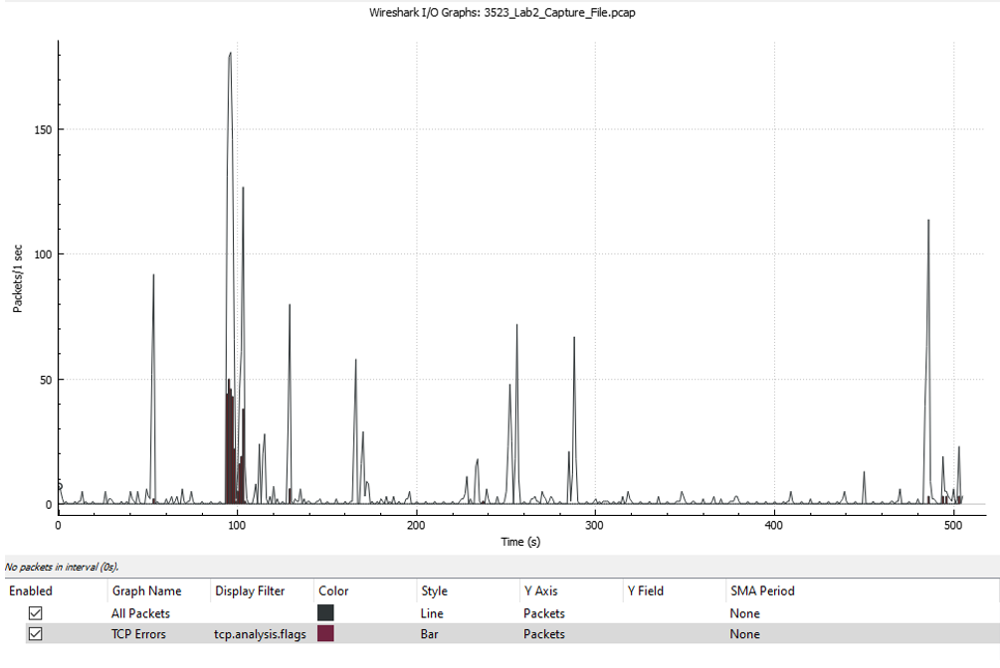

#Introduction

One of the main problems with cyber security and digital investigations is that there is a notable lack of physical evidence to suggest that an event took place. Rather than fingerprints, murder weapons, or a mountain of cocaine stashed in a summer home in Columbia, digital investigators must instead look through logs of captured network traffic in order to find their perpetrator and, more importantly, exactly what happened. And yet, in the same way that an expert forensic investigator can tell a great deal about an incident only from fingerprints or blood splatters, the same can be said about the potential information captured from packet sniffers. In this lab, I will be analyzing a capture file with two packet sniffing programs, Wireshark and NetworkMiner, in addition to checking the file with the IDS software Snort to see if there were any intrusions or breaches.

## Acquiring Files and Setting Up Workspace

Rather than directly capture network activity from either my own computer or a virtual machine, a PCAP file with capture information has been provided. Initially, I had intended to do this lab using one of the SimSpace virtual machines. I begin by downloading the PCAP file and saving it to my computer. From there, I opened up SimSpace and selected a terminal. The difficulty here is that SimSpace virtual machines are self-contained; meaning that they are isolated from the internet and as such, are not able to retrieve files by conventional means. SimSpace had provided instructions on how to retrieve files from my computer, but I was unable to get it to work. After numerous attempts at entering the destination address, the computer was unable to connect and retrieve the files. Figure 1 displays the endless console errors I get when using the “wget” command. No matter how many ways I tried, I was unable to get this to work. Therefore, the lab will take place on my own computer.

- <i>Figure 1</i>: The errors I would receive whenever I would try to access the uploaded file from SimSpace. Despite entering the address correctly, the connection could not be established, and the file could not be retrieved. Therefore, I could not use SimSpace to perform the lab.

  

Choosing this course of action did simplify a few things, but now there were some configurations that were preloaded on the virtual machines that I had to manually set up. For instance, I already have the latest version of Wireshark installed but I needed to acquire versions of NetworkMiner and Snort. The versions I am running are 3.4.9 for Wireshark, 2.7.1 for NetworkMiner, and 2.9.18.1 for Snort. Setting up NetworkMiner was relatively painless, however Snort was a nightmare. Nevertheless, I have all the tools and materials necessary loaded on my computer and I am ready to begin the first steps of analysis.

## Analyzing the Capture File with Wireshark

### Basic Statistics

From my experience with the packet sniffers so far, I find that Wireshark is better in terms of giving comprehensive packet information and fundamental statistics. As such, I will be using Wireshark to analyze the more basic properties of the capture file.

To start simple, the capture session lasted for 505.697 seconds or approximately 8.43 minutes. As such, this is considered a “short term” capture. Moreover, there were 2,449 packets captured and the statistics indicate that all packets were successfully captured and displayed. With all the packets combined, there is a grand total of 811,157 bytes worth of captured data with the average packet containing about 311 bytes. This total converts to 811.157 kilobytes of data. While this may be small, it is not insignificant.

- <i>Figure 2</i>: Basic statistics for the capture file. All packets were successfully captured with no loss.

  

### Protocols in the Capture Files

Overall, there is quite a variety of packets that were captured. This includes those that are typical of a capture including ARP, DNS, FTP, HTTP, TCP, and UDP. Additionally, however, there are a few that are rather uncommon. First, there is the BROWSER protocol which “operates on top of SMB (Server Message Block, a file sharing protocol) and is used to discover machines and resources on the network” (Microsoft Security Response Center 2011). The second one is DHCP or “Dynamic Host Configuration Protocol” which “automate[s] the process of configuring devices on IP networks thus allowing them to use network services such as DNS, NTP, and any communication protocol based on UDP or TCP” (EfficientIP n.d.). In this case, this protocol is being used to connect the user’s computer to his gateway or modem. This will be further covered in a later section. The next protocol is FTP-DATA. This one is a bit unclear, but I have gathered that it is an FTP packet that works through a different port than regular FTP. This next protocol, MDNS, is the lost of the more modern protocols and comes with a few security concerns. The Multicast DNS protocol helps with name resolution in smaller networks and works by directly addressing all participants in a network (Ionos 2020). This means that once the query is answered, all the names of the devices in a LAN will be revealed. This can be troubling if an intruder gets to use it.

- <i>Figure 3</i>: A diagram showing the packets that were captured along with their distribution. Notice that a vast majority of the packets are TCP.

  

These last few protocols are dated and indicative of the timeframe in which this capture took place. The first two, SSLv2 and SSLv3, are derived from the Secure Socket Layer protocols. This is considered to be and “old version of the security system that underlies secure Web transactions (Mozilla 2014). Nowadays, these protocols are outdated, and it is now commonly known that they are full of security holes. The next protocol, NBNS is the “NetBIOS Name Service.” This protocol “allows legacy computer applications relying on the NetBIOS [API]…to be used on TCP/IP networks” (NCSC [n.d.]). It works similarly to DNS in that it translates human names to IP addresses but does so in a way that is compatible with the devices of its time. Finally, the last protocol is TiVoConnect. This is a packet that came with a service package from TiVo that “allows two or more machines running TiVo connect software…to discover each other” (TiVo Connect Automatic Machine Discovery 2003 p. 2). This was convenient for customers since it gave them the ability to easily connect their devices but as I will cover in a later part, this luxury can turn into a serious threat if an intruder manages to get into the network.

Finally, I wish to conclude this subsection by discussing a few security concerns I already have. First, the contents of FTP packets are sent in plain text. This means that anyone who intercepts this packet can directly read its contents. Moreover, and perhaps to my benefit, a packet sniffer such as Wireshark can follow its TCP stream and have a transcript of the communication in ASCII format. This can be a problem especially if the packet contains a password. Similarly, HTTP packets are not encrypted and can also be intercepted and read. Thirdly, the aforementioned SSL protocols are dated and full of exploitable holes. Although this is bad for the user, some of this information will actually help me to reveal the attacker later. 

### Identifying the Transmission Spike

One of my favorite features in Wireshark is the ability to graph the number of packets sent over time. This capture file has several spikes, but none are quite as significant as the one that takes place between the 90 and 109 second mark. It is here where the bulk of the data is transmitted. Moreover, you can also find the greatest amount of TCP errors here. Analysis of the packets in this timeframe indicate that the spike comes from the user’s computer accessing RBFCU’s website. A three-way handshake is established between the server and the user, and each packet sent thereafter is dedicated to loading RBFCU’s homepage. However, this is unusual since the user has stated in the lab instructions that he only uses his network to access his ISP and check his email. This does not usually generate a large amount of network activity so accessing a webpage as large as RBFCU sticks out like a sore thumb. This is our first clue that there is something unusual going on in the user’s network.

- <i>Figure 4</i>: A graph depicting the number of packets sent over time. As mentioned, there are multiple spikes of information, but the greatest one takes place between 90 and 109 seconds with the most amount of information and TCP errors being sent. This spike is the intruder connecting to RBFCU’s homepage.

  

## Analyzing the Capture File with NetworkMiner

Although Wireshark is an excellent packet sniffer for robust and comprehensive analysis, I have found NetworkMiner to be better in providing succinct information about the hosts and any potential anomalies. In other words, “NetworkMiner is a host centric network analysis tool with passive sniffing capabilities. Host centric means that it sorts data with respect to the hosts rather than the packets” (Khurshid 2013). As an aside, this can be extremely helpful for discrete security since a passive packet sniffer does not send requests and sits on the network without being detected. This half of the analysis will be dealing with more specific information about the hosts and user(s) on the network.

### Tracking the ISP Websites Visited

To begin, there were several ISP websites that were visited. This only serves as more evidence for an anomaly since if it were just the user on the network, there would only be network activity for his ISP. However, the hostnames indicate that connections were made to AOL, MSN, and Yahoo (I will reveal which one belongs to the user later). Moreover, there are several incomplete connections (especially for AOL) in which no packets were transmitted or received.

### The Architecture of the User's LAN

The structure of the user’s local area network is fairly simple. The host computer has the name [KaufmanUpstairs] and has an IP address of 172.16.1.35. This computer is using the operating system Windows 2000 Professional (another sign of the times). The local network (listed in Figure 5) is as follows: First, there is a modem (or gateway) made by the defunct company, 2Wire (172.16.0.1). In NetworkMiner, it has the name [homeportal.gateway.2wire.net]. Next, there is a router by Linksys (172.16.1.37). This has the name [DVR-8525.local]. Now, of course, there is the user’s computer (172.16.1.35). Its full name is [KaufmanUpstairs][KAUFMANUPSTAIRS<00>]. Finally, there is a Xerox printer connected to the computer (172.16.1.39). Its name is [KaufmanUpstairs][KAUFMANUPSTAIRS<00>][KAUFMANUPSTAIRS]. Finally, to address the final question, since the only computer on the local area network is the user’s computer, I can therefore conclude that no other computers were accessed on the local area network.

- <i>Figure 5</i> : NetworkMiner’s diagram of the LAN. The first address is the 2Wire modem (172.16.0.1), the next is the Xerox printer (172.16.1.39), then the user’s Windows computer (172.16.1.35), and finally the Linksys router (172.16.1.37).

  

## Putting the Pieces Together

As I have been alluding in the previous sections, there is indeed evidence that there was an intruder in the network. As mentioned, the user only uses his computer to access his ISP’s website to check his email. Therefore, one can quickly conclude that any other internet activity is not being done by him. Furthermore, there was another computer connected with FreeBSD (a distro of Linux) as its operating system. This most certainly did not come from the user since he owns only one computer with Windows 2000 Professional as the operating system (If that is not enough, scanning several chat forums indicates that FreeBSD is a very popular OS for hacking!). As such, any connection that is established with a Linux or FreeBSD machine is considered to belong to the hacker. 

- <i>Figure 6</i>: A list of all the hosts in the capture file in ascending order based on the number of router hops. In other words, the connections are ordered from physically nearest to farthest. Notice that the intruder’s FreeBSD machine is visible here. As mentioned, any connection that deals with either Linux or FreeBSD belongs to the intruder.

  

Therefore, the hacker is accessing Yahoo and dialing in to AOL, and MSN is the user’s true ISP website. With this in mind, the following “story” can be drawn:

The user first logs into his computer and connects to the internet through his modem. Then, as NetworkMiner indicates, the intruder enters the network by changing his MAC address so that his machine can associate with the user’s IP address.

- <i>Figure 7</i>: NetworkMiner’s message under the “Anomalies” tab. It almost immediately detected the ARP spoofing. Therefore, I would consider NetworkMiner to be an extremely useful tool for quick diagnostics.

  

He then logs on anonymously to a Linux-based wireless local area network (WLAN) with that same IP address.

- <i>Figure 8</i>: The TCP stream of the intruder as he connects to the WLAN. These packets are FTP so everything that is communicated is displayed in plain text including the password for the account. Notice how the system tells the intruder that he was logged on anonymously. He also enters is “passive” mode so that he will be less likely to be detected on the network.

  

Then, while the intruder is sitting on the network, the user remains oblivious and connects to MSN presumably to check his email. Shortly thereafter, the intruder begins moving around and tries to access RBFCU’s website. This is where the spike in packets occurs. Now a large amount of the capture session is dedicated to the TCP connections between the intruder (with the user’s IP address) and RBFCU’s server. At this point, there begins to be some visible errors in communication between the user and MSN. After the intruder is done with this, he logs into his Yahoo account to check his own email. Then, with the user still occupied, he dials into AOL, and I assume he begins messaging other people. Now things get interesting! Still using the user’s IP address, the intruder begins sending out ARP requests to locate the other devices on the user’s LAN. In doing so, he discovers that the user has machines running TiVo connect software.  Here is where this service becomes a downfall. With the user’s IP address, the intruder can hack into the TiVo Connect network and access his modem. The intruder now has total access to the user’s connection and spends the remainder of the capture messaging on AOL to his heart’s content. I cannot say for sure what the intruder’s intentions were, but given that this capture took place in 2005, I suspect that he was just looking for some free internet. Nevertheless, this whole thing is a serious concern security-wise. I can only say that the user was lucky that the intruder was not apparently malicious.

## Trying (and failing) to Analyze the Capture File with Snort

It is at this point performing the lab with my own computer becomes a downfall. Wireshark and NetworkMiner were simple enough to set up, but Snort had proved to be too great of a challenge. Installing the software itself was easy but the problems were in configuring the software and installing supporting programs. The program had failed to even launch, and I had to alternate between several copies of WinPCap and Ncap until I got it to work. Then, after a visit with the user manual, I managed to load the PCAP file onto Snort for analysis. The program read through the capture file in seconds, but no alerts were returned or recorded. The only things that were printed were the same basic statistics that Wireshark displayed. Even after wrestling with Snort’s configuration file and setting up rules for hours on end, I was unable to get Snort to read anything significant. As such, I was unable to record any alerts that the program would have stated.

- <i>Figure 9</i>: A snippet of the output from Snort. Although there was some loss in packets, it did not detect any anomalies and as such, did not send out any warnings. However, I am doubtful that a program as esteemed as Snort would fail to detect this, and I therefore conclude this to be due to user error.

  

# Conclusion

Excruciating challenges and speedbumps aside, I found this lab to be extremely entertaining. I thought it was exciting to analyze the capture file like a detective at a crime scene and come up with my own conclusion of what took place. It also provided some insight of the digital vulnerabilities that laid in computing devices at the time and how even a tech-savvy person is not necessarily safe from them. Although I think an event such as this does not happen as often anymore, the skills I gained from my investigation and analysis of this event will be invaluable for addressing future scenarios that are similar to this one.

# References

- <a href="https://www.ncsc.gov.ie/emailsfrom/DDoS/NetBIOS/" target="_blank">Internet Accessible Netbios Name Service - NCSC</a>

- <a href="https://www.maketecheasier.com/capture-and-analyze-network-traffic/" target="_blank">How to Capture and Analyze Network Traffic Using NetworkMiner - Usman Khurshid</a>

- <a href="https://www.ionos.com/digitalguide/server/know-how/multicast-dns/" target="_blank">Multicast DNS: Alternative Name Resolution on a Small Scale - IONOS Digitalguide</a>

- <a href="https://blog.mozilla.org/security/2014/10/14/the-poodle-attack-and-the-end-of-ssl-3-0/" target="_blank">The Poodle Attack and the End of SSL 3.0 - Mozilla Security Blog</a>

- <a href="https://msrc-blog.microsoft.com/2011/02/16/notes-on-exploitability-of-the-recent-windows-browser-protocol-issue/" target="_blank">Notes on Exploitability of the Recent Windows Browser Protocol Issue - Swiat, Microsoft Security Response Center</a>

- <a href="http://tivopod.sourceforge.net/tivoconnect.pdf" target="_blank">TiVo Connect Automatic Machine Discovery - Sourceforge</a>

- <a href="https://www.efficientip.com/what-is-dhcp-and-why-is-it-important/" target="_blank">What Is DHCP and Why Is It Important? - EfficientIP</a>

